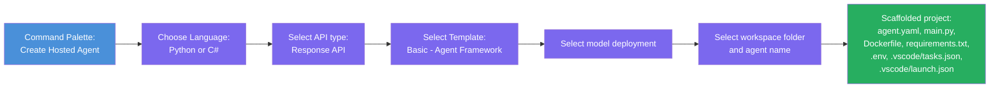

# Module 3 - Create a New Hosted Agent (Auto-Scaffolded by Foundry Toolkit)

In this module, you use Foundry Toolkit (Microsoft Foundry commands in VS Code) to **scaffold a new [hosted agent](https://learn.microsoft.com/azure/foundry/agents/concepts/hosted-agents) project**. The scaffold generates the project structure for you - including `agent.yaml`, `main.py`, `Dockerfile`, `requirements.txt`, a `.env` file, and a VS Code debug configuration. After scaffolding, you customize these files with your agent's instructions, tools, and configuration.

> **Key concept:** The `agent/` folder in this lab is an example of what Foundry Toolkit generates when you run this scaffold command. You don't write these files from scratch - Foundry Toolkit creates them, and then you modify them.

### Scaffold wizard flow



---

## Step 1: Open the Create Hosted Agent wizard

1. Press `Ctrl+Shift+P` to open the **Command Palette**.
2. Type: **Microsoft Foundry: Create a New Hosted Agent** and select it.
3. The hosted agent creation wizard opens.

> **Alternative path:** You can also reach this wizard from the Microsoft Foundry sidebar → click the **+** icon next to **Agents** or right-click and select **Create New Hosted Agent**.

---

## Step 2: Choose programming language

1. Select **Python** (recommended for this workshop).
2. Click **Next**.

> **C# is also supported** if you prefer .NET. The scaffold structure is similar (uses `Program.cs` instead of `main.py`).

---

## Step 3: Select API type

The wizard asks how your agent receives and responds to requests:

| API type | Endpoint | Use when |
|----------|----------|----------|
| **Response API** ✅ *(this workshop)* | `POST /responses` | Conversational chatbots, streaming, multi-turn with platform-managed history |
| Invocation API | `POST /invocations` | Webhooks, non-conversational processing, custom async workflows |

1. Select **Response API**.
2. Click **Next**.

---

## Step 4: Select template

Available templates for Response API + Python (Foundry Toolkit v1.2.1):

| Template | Description |
|----------|-------------|
| **Basic - Agent Framework** ← *(select this)* | A basic agent using the Agent Framework SDK |
| Echo (Streaming) | A basic echo agent with streaming support |
| Multi-Turn Chat | An agent that supports multi-turn conversations |
| Note Taking | An agent with note-taking capabilities |

1. Select **Basic - Agent Framework**.
2. Click **Next**.

---

## Step 5: Select your model

1. The wizard shows the models deployed in your Foundry project (from Module 2).
2. Select the model you deployed - e.g., **gpt-4.1-mini**.
3. Click **Next**.

> If you don't see any models, go back to [Module 2](02-create-foundry-project.md) and deploy one first.

---

## Step 6: Choose workspace and agent name

1. Select your **Foundry workspace** from the list.
2. A file dialog opens - choose a **target folder** where the project will be created. For this workshop:
   - If starting fresh: choose any folder (e.g., `C:\Projects\my-agent`)
   - If working within the workshop repo: create a new subfolder under `workshop/lab01-single-agent/agent/`
3. Enter a **name** for the hosted agent (e.g., `executive-summary-agent` or `my-first-agent`).
4. Click **Create** (or press Enter).

---

## Step 7: Wait for scaffolding to complete

1. VS Code opens the scaffolded project (often in a **new window**).
2. Make sure your **active workspace/folder** is the scaffolded agent folder before continuing.
3. Wait a few seconds for the project to fully load.
4. You should see the following files in the Explorer panel (`Ctrl+Shift+E`):

```
📂 my-first-agent/
├── .env                ← Environment variables (auto-generated with placeholders)
├── .vscode/
│   ├── launch.json     ← Debug configuration (F5 to run + Agent Inspector)
│   └── tasks.json      ← VS Code task definitions (run server, open Agent Inspector)
├── agent.yaml          ← Agent definition (kind: hosted)
├── Dockerfile          ← Container configuration for deployment
├── main.py             ← Agent entry point (your main code file)
└── requirements.txt    ← Python dependencies
```

> **This is the same structure as the `agent/` folder** in this lab. The Foundry extension generates these files automatically - you don't need to create them manually.

> **Workspace note (important):** Open the scaffolded agent folder itself in VS Code (for example, `agent/`) and use its local `.vscode/launch.json` and `.vscode/tasks.json`.
>
> Before Module 4, confirm you are editing the intended folder and the expected `main.py`, `.env`, and `agent.yaml` files.

---

## Step 8: Understand each generated file

Take a moment to inspect each file the wizard created. Understanding them is important for Module 4 (configuration) and Module 5 (local testing).

### 8.1 `agent.yaml` - Agent definition

Open `agent.yaml`. It looks like this:

```yaml
kind: hosted
name: my-first-agent
description: >
  A hosted agent deployed to Microsoft Foundry Agent Service.
metadata:
  authors:
    - Microsoft
  tags:
    - Azure AI AgentServer
    - Microsoft Agent Framework
    - Hosted Agent
protocols:
  - protocol: responses
    version: 1.0.0
resources:
  cpu: ''
  memory: ''
environment_variables:
  - name: AZURE_AI_PROJECT_ENDPOINT
    value: ${AZURE_AI_PROJECT_ENDPOINT}
  - name: MODEL_DEPLOYMENT_NAME
    value: ${MODEL_DEPLOYMENT_NAME}
```

> **Note:** The wizard leaves `name`, `cpu`, and `memory` blank. `name` is set when you run the deploy command. `cpu` and `memory` are selected interactively by the VS Code extension at deploy time - no manual edits needed.

**Key fields:**

| Field | Purpose |
|-------|---------|
| `kind: hosted` | Declares this is a hosted agent (container-based, deployed to [Foundry Agent Service](https://learn.microsoft.com/azure/foundry/agents/overview)) |
| `protocols: responses 1.0.0` | The agent exposes the OpenAI-compatible `/responses` HTTP endpoint |
| `environment_variables` | Maps `.env` values to container env vars at deployment time |
| `resources` | CPU/memory for the container sandbox - selected during deployment by the VS Code extension (supports 0.25 vCPU/0.5 GiB up to 2 vCPU/4 GiB) |

### 8.2 `main.py` - Agent entry point

Open `main.py`. This is the main Python file where your agent logic lives. The scaffold includes:

```python
from agent_framework import Agent
from agent_framework.foundry import FoundryChatClient
from agent_framework_foundry_hosting import ResponsesHostServer
from azure.identity import DefaultAzureCredential
```

**Key imports:**

| Import | Purpose |
|--------|--------|
| `FoundryChatClient` | Connects to your Foundry project model endpoint with your credential |
| `Agent` | Wraps the client with instructions and optional tools to create the agent logic |
| `ResponsesHostServer` | Wraps the agent as an HTTP server exposing the `/responses` endpoint |
| [`DefaultAzureCredential`](https://learn.microsoft.com/azure/developer/python/sdk/authentication/credential-chains#defaultazurecredential-overview) | Handles authentication (Azure CLI, VS Code sign-in, managed identity, or service principal) |

The main flow is:
1. Create a `FoundryChatClient` (endpoint + model + credential) → create an `Agent(client=...)` with instructions → wrap in `ResponsesHostServer` → call `server.run()`

### 8.3 `Dockerfile` - Container image

```dockerfile
FROM python:3.12-slim

WORKDIR /app

COPY . user_agent/
WORKDIR /app/user_agent

RUN if [ -f requirements.txt ]; then \
        pip install -r requirements.txt; \
    else \
        echo "No requirements.txt found"; \
    fi

EXPOSE 8088

CMD ["python", "main.py"]
```

**Key details:**
- Uses `python:3.12-slim` as the base image.
- Copies all project files into `/app/user_agent` and sets that as the working directory.
- Installs dependencies from `requirements.txt`.
- **Exposes port 8088** - this is the required port for hosted agents. Do not change it.
- Starts the agent with `python main.py`.

### 8.4 `requirements.txt` - Dependencies

```
agent-framework>=1.1.0
agent-framework-foundry-hosting
debugpy
```

| Package | Purpose |
|---------|--------|
| `agent-framework` | [Microsoft Agent Framework](https://learn.microsoft.com/agent-framework/overview/agent-framework-overview) - `Agent`, `FoundryChatClient`, `@tool`, and core runtime |
| `agent-framework-foundry-hosting` | Hosted agent server runtime - `ResponsesHostServer` for [Foundry Agent Service](https://learn.microsoft.com/azure/foundry/agents/overview) |
| `debugpy` | Python debugging support (allows F5 debugging in VS Code) |

### 8.5 `.vscode/` - Debug configuration

The scaffold generates two VS Code configuration files:

**`launch.json`** - attaches the debugger to the running server process (triggered by F5):
- Connects to the debugpy listener on `localhost:5679`
- Runs the `Open Agent Inspector` pre-launch task (which in turn starts the HTTP server)

**`tasks.json`** - defines three tasks that run in sequence:

| Task | What it does |
|------|-------------|
| `Validate prerequisites` | Checks port 5679/8088 are free **and** `agent-framework`/`debugpy` are installed in the active Python interpreter |
| `Run Agent/Workflow HTTP Server` | Starts `python -m debugpy --listen 127.0.0.1:5679 main.py --port 8088` using the VS Code-selected interpreter |
| `Open Agent Inspector` | Opens the Foundry Toolkit Agent Inspector UI for interactive testing |

> **The prerequisite check will fail if packages are not installed.** Before pressing F5, create a virtual environment, select it in VS Code, and run `pip install -r requirements.txt`. See [Module 4, Step 4](04-configure-and-code.md#step-4-create-and-activate-a-virtual-environment) for the full steps.

---

## Understanding the agent protocol

Hosted agents communicate via the **OpenAI Responses API** protocol. When running (locally or in the cloud), the agent exposes a single HTTP endpoint:

```
POST http://localhost:8088/responses
Content-Type: application/json

{
  "input": "Your prompt here",
  "stream": false
}
```

The Foundry Agent Service calls this endpoint to send user prompts and receive agent responses. This is the same protocol used by the OpenAI API, so your agent is compatible with any client that speaks the OpenAI Responses format.

---

### Checkpoint

- [ ] The scaffold wizard completed successfully and the scaffolded project is open in your active VS Code workspace
- [ ] You can see all 6 files: `agent.yaml`, `main.py`, `Dockerfile`, `requirements.txt`, `.env`, and `.vscode/tasks.json` + `launch.json`
- [ ] The `.vscode/launch.json` and `.vscode/tasks.json` files exist (enable F5 debugging and the prerequisite check)
- [ ] You've read through each file and understand its purpose
- [ ] You understand that port `8088` is required and the `/responses` endpoint is the protocol

---

**Previous:** [02 - Create Foundry Project](02-create-foundry-project.md) · **Next:** [04 - Configure & Code →](04-configure-and-code.md)
