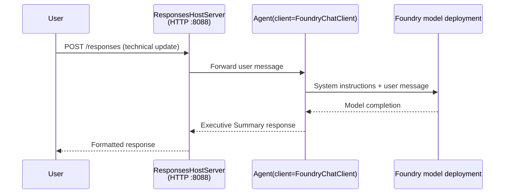
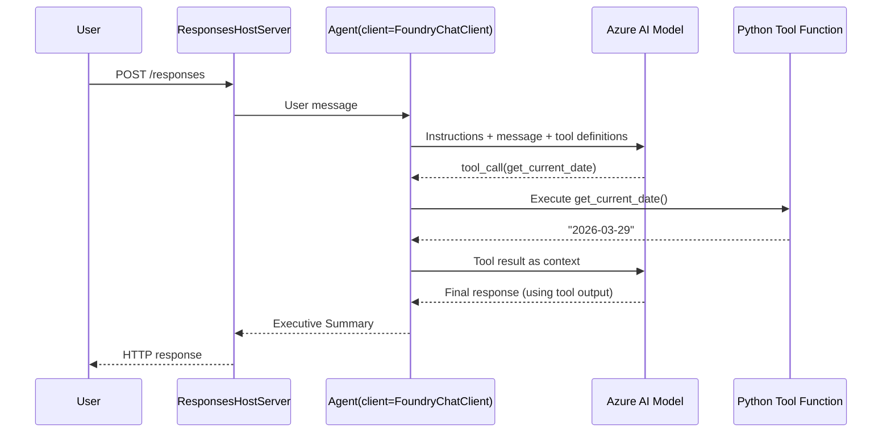

# Module 4 - Configure Instructions, Environment & Install Dependencies

In this module, you customize the auto-scaffolded agent files from Module 3. This is where you transform the generic scaffold into **your** agent - by writing instructions, setting environment variables, optionally adding tools, and installing dependencies.

> **Reminder:** The Foundry extension generated your project files automatically. Now you modify them. See the [`agent/`](../agent/) folder for a complete working example of a customized agent.

---

## How the components fit together

### Request lifecycle (single agent)



> **With tools:** If the agent has tools registered, the model may return a tool-call instead of a direct completion. The framework executes the tool locally, feeds the result back to the model, and the model then generates the final response.



---

## Step 1: Configure environment variables

The scaffold created a `.env` file with placeholder values. You need to fill in the real values from Module 2.

1. In your scaffolded project, open the **`.env`** file (it's in the project root).
2. Replace the placeholder values with your actual Foundry project details:

   ```env
   AZURE_AI_PROJECT_ENDPOINT=https://<your-account>.services.ai.azure.com/api/projects/<your-project>
   MODEL_DEPLOYMENT_NAME=gpt-4.1-mini
   ```

3. Save the file.

### Where to find these values

| Value | How to find it |
|-------|---------------|
| **Project endpoint** | Open the **Microsoft Foundry** sidebar in VS Code → click on your project → the endpoint URL is shown in the detail view. It looks like `https://<account-name>.services.ai.azure.com/api/projects/<project-name>` |
| **Model deployment name** | In the Foundry sidebar, expand your project → look under **Models + endpoints** → the name is listed next to the deployed model (e.g., `gpt-4.1-mini`) |

> **Security:** Never commit the `.env` file to version control. It's already included in `.gitignore` by default. If it's not, add it:
> ```
> .env
> ```

### How environment variables flow

The mapping chain is: `.env` → `main.py` (reads via `os.environ`) → `agent.yaml` (maps to container env vars at deploy time).

In `main.py`, the scaffold reads these values directly:

```python
client = FoundryChatClient(
    project_endpoint=os.environ["AZURE_AI_PROJECT_ENDPOINT"],
    model=os.environ["MODEL_DEPLOYMENT_NAME"],
    credential=DefaultAzureCredential(),
)
```

`os.environ[...]` raises `KeyError` if the variable is missing - make sure both are set in `.env` before running.

---

## Step 2: Write agent instructions

This is the most important customization step. The instructions define your agent's personality, behavior, output format, and safety constraints.

1. Open `main.py` in your project.
2. Find the instructions string (the scaffold includes a default/generic one).
3. Replace it with detailed, structured instructions.

### What good instructions include

| Component | Purpose | Example |
|-----------|---------|---------|
| **Role** | What the agent is and does | "You are an executive summary agent" |
| **Audience** | Who the responses are for | "Senior leaders with limited technical background" |
| **Input definition** | What kind of prompts it handles | "Technical incident reports, operational updates" |
| **Output format** | Exact structure of responses | "Executive Summary: - What happened: ... - Business impact: ... - Next step: ..." |
| **Rules** | Constraints and refusal conditions | "Do NOT add information beyond what was provided" |
| **Safety** | Prevent misuse and hallucination | "If input is unclear, ask for clarification" |
| **Examples** | Input/output pairs to steer behavior | Include 2-3 examples with varying inputs |

### Example: Executive Summary Agent instructions

Here's the instructions used in the workshop's [`agent/main.py`](../agent/main.py):

```python
AGENT_INSTRUCTIONS = """You are an "Explain Like I'm an Executive" agent.

Purpose:
Your job is to translate complex technical or operational information into
clear, concise, and outcome-focused summaries that can be easily understood
by non-technical executives.

Audience:
Senior leaders with limited technical background who care about impact,
risk, and what happens next.

What you must do:
- Rephrase the input so it is understandable to a non-technical audience
- Prioritize clarity, brevity, and outcomes over technical accuracy
- Remove technical jargon, logs, metrics, stack traces, and deep root-cause details
- Translate technical causes into simple cause-and-effect statements
- Explicitly call out business impact
- Always include a clear next step or action
- Maintain a neutral, factual, and calm executive tone
- Do NOT add new facts or speculate beyond the input

Standard Output Structure (always use this wording):

Executive Summary:
- What happened: <plain-language description>
- Business impact: <clear, non-technical impact>
- Next step: <clear action or mitigation>

Rules:
- Keep responses under 100 words
- Do NOT add facts beyond the input
- If input is unclear, ask for clarification
"""
```

4. Replace the existing instructions string in `main.py` with your custom instructions.
5. Save the file.

---

## Step 3: (Optional) Add custom tools

Hosted agents can execute **local Python functions** as [tools](https://learn.microsoft.com/azure/foundry/agents/concepts/tool-catalog). This is a key advantage of code-based hosted agents over prompt-only agents - your agent can run arbitrary server-side logic.

### 3.1 Define a tool function

Add a tool function to `main.py`:

```python
from agent_framework import tool

@tool
def get_current_date() -> str:
    """Returns the current date in YYYY-MM-DD format."""
    from datetime import date
    return str(date.today())
```

The `@tool` decorator turns a standard Python function into an agent tool. The docstring becomes the tool description that the model sees.

### 3.2 Register the tool with the agent

Pass the tool in the `tools` parameter when constructing the `Agent`:

```python
client = FoundryChatClient(
    project_endpoint=os.environ["AZURE_AI_PROJECT_ENDPOINT"],
    model=os.environ["MODEL_DEPLOYMENT_NAME"],
    credential=DefaultAzureCredential(),
)

agent = Agent(
    client=client,
    instructions=AGENT_INSTRUCTIONS,
    tools=[get_current_date],
)

server = ResponsesHostServer(agent)
server.run()
```

### 3.3 How tool calls work

1. The user sends a prompt.
2. The model decides whether a tool is needed (based on the prompt, instructions, and tool descriptions).
3. If a tool is needed, the framework calls your Python function locally (inside the container).
4. The tool's return value is sent back to the model as context.
5. The model generates the final response.

> **Tools execute server-side** - they run inside your container, not in the user's browser or the model. This means you can access databases, APIs, file systems, or any Python library.

---

## Step 4: Create and activate a virtual environment

Before installing dependencies, create an isolated Python environment.

> ⚠️ **Warning (do not skip):** If you run the agent without an activated virtual environment and without installing `requirements.txt`, local run/debug will fail (missing imports such as `agent_framework` / `agent_framework_foundry_hosting`). Always complete **Step 4.2** and **Step 4.3** before moving to Module 5.

### 4.1 Create the virtual environment

Open a terminal in VS Code (`` Ctrl+` ``) and run:

```powershell
python -m venv .venv
```

This creates a `.venv` folder in your project directory.

### 4.2 Activate the virtual environment

**PowerShell (Windows):**

```powershell
.\.venv\Scripts\Activate.ps1
```

**Command Prompt (Windows):**

```cmd
.venv\Scripts\activate.bat
```

**macOS/Linux (Bash):**

```bash
source .venv/bin/activate
```

You should see `(.venv)` appear at the start of your terminal prompt, indicating the virtual environment is active.

### 4.3 Install dependencies

With the virtual environment active, install the required packages:

```powershell
pip install -r requirements.txt
```

This installs:

| Package | Purpose |
|---------|---------|
| `agent-framework>=1.1.0` | [Microsoft Agent Framework](https://learn.microsoft.com/agent-framework/overview/agent-framework-overview) - `Agent`, `FoundryChatClient`, `@tool`, and core runtime |
| `agent-framework-foundry-hosting` | Hosted agent server runtime - `ResponsesHostServer` that exposes the `/responses` endpoint for [Foundry Agent Service](https://learn.microsoft.com/azure/foundry/agents/overview) |
| `debugpy` | Python debugging (enables F5 debugging in VS Code) |

### 4.4 Verify installation

```powershell
pip list | Select-String "agent-framework"
```

Expected output:
```
agent-framework                    1.1.x
agent-framework-foundry-hosting    x.x.x
```

---

## Step 5: Verify authentication

The agent uses [`DefaultAzureCredential`](https://learn.microsoft.com/azure/developer/python/sdk/authentication/credential-chains#defaultazurecredential-overview) which tries multiple authentication methods in this order:

1. **Environment variables** - `AZURE_CLIENT_ID`, `AZURE_TENANT_ID`, `AZURE_CLIENT_SECRET` (service principal)
2. **Azure CLI** - picks up your `az login` session
3. **VS Code** - uses the account you signed into VS Code with
4. **Managed Identity** - used when running in Azure (at deployment time)

### 5.1 Verify for local development

At least one of these should work:

**Option A: Azure CLI (recommended)**

```powershell
az account show --query "{name:name, id:id}" --output table
```

Expected: Shows your subscription name and ID.

**Option B: VS Code sign-in**

1. Look at the bottom-left of VS Code for the **Accounts** icon.
2. If you see your account name, you're authenticated.
3. If not, click the icon → **Sign in to use Microsoft Foundry**.

**Option C: Service principal (for CI/CD)**

```powershell
$env:AZURE_TENANT_ID = "<your-tenant-id>"
$env:AZURE_CLIENT_ID = "<your-client-id>"
$env:AZURE_CLIENT_SECRET = "<your-client-secret>"
```

### 5.2 Common auth issue

If you are signed into multiple Azure accounts, make sure the correct subscription is selected:

```powershell
az account set --subscription "<your-subscription-id>"
```

---

### Checkpoint

> ✅ **Final Note before testing:** Do not proceed to [Module 5](05-test-locally.md) until both are true in the same terminal/session: **(1)** `(.venv)` is visible in the prompt, and **(2)** `pip install -r requirements.txt` has completed successfully.

- [ ] `.env` file has valid `AZURE_AI_PROJECT_ENDPOINT` and `MODEL_DEPLOYMENT_NAME` (not placeholders)
- [ ] Agent instructions are customized in `main.py` - they define role, audience, output format, rules, and safety constraints
- [ ] (Optional) Custom tools are defined and registered
- [ ] Virtual environment is created and activated (`(.venv)` visible in terminal prompt)
- [ ] `pip install -r requirements.txt` completes successfully without errors
- [ ] `pip list | Select-String "agent-framework"` shows `agent-framework` and `agent-framework-foundry-hosting` are installed
- [ ] Authentication is valid - `az account show` returns your subscription OR you're signed into VS Code

---

**Previous:** [03 - Create Hosted Agent](03-create-hosted-agent.md) · **Next:** [05 - Test Locally →](05-test-locally.md)
