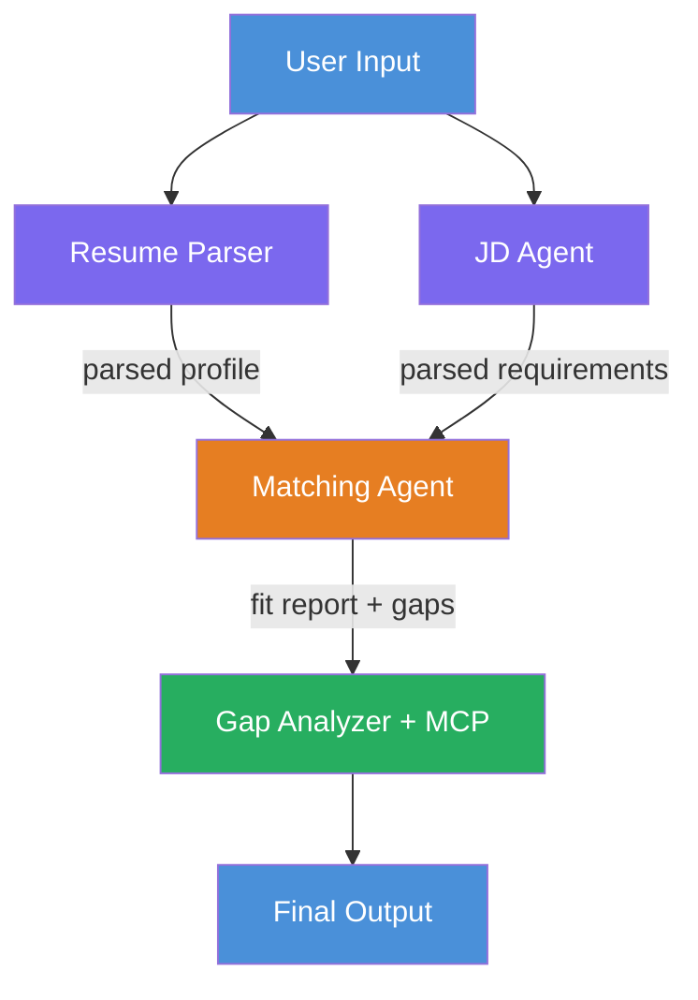

# Module 1 - Understand the Architecture

Before writing any code, here's a quick overview of what you're building and how it works.

---

## What you're building

You paste in a **resume** and a **job description**. The workflow returns:

- A fit score (0–100 with a breakdown)
- A list of skill and certification gaps
- A personalized learning roadmap with Microsoft Learn links for each gap

---

## The four agents

A single agent trying to parse, score, and plan all at once tends to rush and produce shallow output. Splitting the work into four specialized agents gives better results:

| Agent | What it does |
|-------|-------------|
| **ResumeParser** | Reads the resume and extracts skills, certifications, experience |
| **JobDescriptionAgent** | Reads the job description and extracts required and preferred skills |
| **MatchingAgent** | Compares the two profiles, produces a 100-point fit score and gap list |
| **GapAnalyzer** | Builds a learning roadmap, searches Microsoft Learn for each gap |

---

## The orchestration graph

The workflow uses **parallel fan-out** followed by **sequential aggregation**:



> **Legend:** Purple = parallel agents, Orange = aggregation point, Green = final agent with tools

1. **ResumeParser** runs first and receives the user input.
2. Its output fans out to **JobDescriptionAgent** and **MatchingAgent** in parallel.
3. **MatchingAgent** waits for both upstream agents before running.
4. **GapAnalyzer** runs last and calls Microsoft Learn for each skill gap.

---

## How this maps to code

In `main.py`, you describe this graph with `WorkflowBuilder`:

```python
workflow_agent = (
    WorkflowBuilder(
        start_executor=resume_executor,       # first agent to receive user input
        output_executors=[gap_executor],      # last agent - its output is the response
    )
    .add_edge(resume_executor, jd_executor)       # ResumeParser → JD Agent
    .add_edge(resume_executor, matching_executor) # ResumeParser → MatchingAgent (fan-out)
    .add_edge(jd_executor, matching_executor)     # JD Agent → MatchingAgent (fan-in)
    .add_edge(matching_executor, gap_executor)    # MatchingAgent → GapAnalyzer
    .build()
    .as_agent()
)
```

Each `Agent` is wrapped in an `AgentExecutor`. The `add_edge()` calls define what data flows where. Because MatchingAgent has two incoming edges, the framework automatically waits for both ResumeParser and JD Agent to finish before running it.

---

## The MCP tool

GapAnalyzer has one tool: `search_microsoft_learn_for_plan`. It connects to `https://learn.microsoft.com/api/mcp` and returns real Microsoft Learn links for each skill gap.

When the tool runs you'll see these logs - all expected:

```
GET  https://learn.microsoft.com/api/mcp → 405   ← connection probe, normal
POST https://learn.microsoft.com/api/mcp → 200   ← actual tool call
DELETE https://learn.microsoft.com/api/mcp → 405 ← cleanup probe, normal
```

Only worry if the `POST` returns an error.

---

**Previous:** [00 - Prerequisites](00-prerequisites.md) · **Next:** [02 - Scaffold the Project →](02-scaffold-multi-agent.md)
