# Module 2 - Scaffold the Multi-Agent Project

In this module, you use the [Microsoft Foundry extension](https://marketplace.visualstudio.com/items?itemName=TeamsDevApp.vscode-ai-foundry) to scaffold a base project. The wizard generates `agent.yaml`, `main.py`, `Dockerfile`, `requirements.txt`, `.env`, and debug configuration. You customize these in Modules 3 and 4.

> **Reference implementation:** [`PersonalCareerCopilot/`](../PersonalCareerCopilot/) is a complete working example. Use it to compare your work as you go.

---

## Step 1: Open the Create Hosted Agent wizard

```mermaid
flowchart LR
    S1["Open Wizard"]
    S2["Choose Language: Python"]
    S3["Select API Type: Responses API"]
    S4["Select Template: Basic Agent Framework"]
    S5["Select Model"]
    S6["Workspace and Folder Name"]
    S7["Scaffold"]

    S1 --> S2 --> S3 --> S4 --> S5 --> S6 --> S7

    style S1 fill:#3498DB,stroke:#2C3E50,color:#fff
    style S2 fill:#9B59B6,stroke:#2C3E50,color:#fff
    style S3 fill:#E67E22,stroke:#2C3E50,color:#fff
    style S4 fill:#E74C3C,stroke:#2C3E50,color:#fff
    style S5 fill:#F39C12,stroke:#2C3E50,color:#fff
    style S6 fill:#E74C3C,stroke:#2C3E50,color:#fff
    style S7 fill:#27AE60,stroke:#2C3E50,color:#fff
```



1. Press `Ctrl+Shift+P` to open the **Command Palette**.
2. Type: **Microsoft Foundry: Create a New Hosted Agent** and select it.
3. The hosted agent creation wizard opens.

> **Alternative:** Click the **Microsoft Foundry** icon in the Activity Bar → click the **+** icon next to **Agents** → **Create New Hosted Agent**.

---

## Step 2: Choose programming language

1. Select **Python**.
2. Click **Next**.

---

## Step 3: Select API type

| API type | Endpoint | Use when |
|----------|----------|----------|
| **Responses API** ✅ *(this workshop)* | `POST /responses` | Conversational chatbots, streaming, multi-turn with platform-managed history |
| Invocation API | `POST /invocations` | Webhooks, non-conversational processing, custom async workflows |

1. Select **Responses API**.
2. Click **Next**.

---

## Step 4: Select template

> ⚠️ **No dedicated multi-agent template exists in v1.2.1.** Select **Basic - Agent Framework** — you add multi-agent code in Module 3. See [KI-002](../../../KNOWN_ISSUES.md#ki-002---no-dedicated-multi-agent-template-in-foundry-toolkit-v121).

1. Select **Basic - Agent Framework**.
2. Click **Next**.

---

## Step 5: Select your model

1. The wizard shows models deployed in your Foundry project.
2. Select the same model you used in Lab 01 (e.g., **gpt-4.1-nano** or **gpt-4.1-mini**).
3. Click **Next**.

> **Tip:** [`gpt-4.1-mini`](https://learn.microsoft.com/azure/foundry/foundry-models/concepts/models-sold-directly-by-azure#gpt-41-series) is recommended for development - it's fast, cheap, and handles multi-agent workflows well. Switch to `gpt-4.1` for final production deployment if you want higher-quality output.

---

## Step 6: Choose workspace folder and folder name

1. A file picker opens for **Workspace Folder**. Browse to your target folder:
   - If following along with the workshop repo: navigate to `workshop/lab02-multi-agent/` and create a new subfolder
   - If starting fresh: choose any folder
2. Enter a **Folder Name** for the agent project (e.g., `resume-job-fit-evaluator`). Press **Enter** to confirm.

---

## Step 7: Wait for scaffolding to complete

1. VS Code opens a new window (or the current window updates) with the scaffolded project.
2. You should see this file structure:

```
resume-job-fit-evaluator/
├── .env                ← Environment variables (placeholders)
├── .vscode/
│   └── launch.json     ← Debug configuration
├── agent.yaml          ← Agent definition (kind: hosted)
├── Dockerfile          ← Container configuration
├── main.py             ← Stub agent code (one executor, no WorkflowBuilder)
└── requirements.txt    ← Python dependencies
```

Open this folder directly in VS Code so the local `.vscode/launch.json` and `.vscode/tasks.json` apply.

---

## Step 8: What the scaffold actually generates

The wizard creates the **same single-agent stub as Lab 01**. You replace it with the 4-agent workflow in Module 3.

### 8.1 `agent.yaml`

```yaml
kind: hosted
name: resume-job-fit-evaluator
description: >
  A helpful assistant.
metadata:
  authors:
    - ShivamGoyal03
protocols:
  - protocol: responses
    version: 1.0.0
resources:
  cpu: '0.25'
  memory: 0.5Gi
environment_variables:
  - name: AZURE_AI_PROJECT_ENDPOINT
    value: ${AZURE_AI_PROJECT_ENDPOINT}
  - name: MODEL_DEPLOYMENT_NAME
    value: ${MODEL_DEPLOYMENT_NAME}
dockerfile_path: Dockerfile
```

### 8.2 `main.py`

A single agent identical to Lab 01:

```python
import os
from agent_framework import Agent
from agent_framework.foundry import FoundryChatClient
from agent_framework_foundry_hosting import ResponsesHostServer
```

`AgentExecutor` and `WorkflowBuilder` are the key additions compared to Lab 01’s single-agent pattern.

### 8.3 `requirements.txt` - Dependencies

```
agent-framework>=1.1.0
agent-framework-foundry-hosting
debugpy
mcp
```

| Package | Purpose |
|---------|---------|
| [`agent-framework>=1.1.0`](https://learn.microsoft.com/agent-framework/overview/) | Core runtime: `Agent`, `AgentExecutor`, `WorkflowBuilder`, `@tool` |
| [`agent-framework-foundry-hosting`](https://learn.microsoft.com/agent-framework/) | `ResponsesHostServer` + Foundry hosting integration |
| `debugpy` | Python debugging (F5 in VS Code) |
| `mcp` | Microsoft Learn MCP client used by the GapAnalyzer tool |

### 8.4 `Dockerfile` - Same as Lab 01

The Dockerfile is identical to Lab 01's - it copies files, installs dependencies from `requirements.txt`, exposes port 8088, and runs `python main.py`.

```dockerfile
FROM python:3.12-slim
WORKDIR /app
COPY . user_agent/
WORKDIR /app/user_agent
RUN if [ -f requirements.txt ]; then \
        pip install -r requirements.txt; \
    else \
        echo "No requirements.txt found"; \
    fi

EXPOSE 8088

CMD ["python", "main.py"]
```

---

### Checkpoint

- [ ] Scaffold wizard completed → new project structure is visible
- [ ] You can see all files: `agent.yaml`, `main.py`, `Dockerfile`, `requirements.txt`, `.env`
- [ ] `requirements.txt` includes `agent-framework>=1.1.0` and `agent-framework-foundry-hosting`
- [ ] You understand that `main.py` is a stub - `mcp` and `WorkflowBuilder` are added in Module 3
- [ ] Next step: update `requirements.txt` (add `mcp`) and `main.py` (add WorkflowBuilder graph)

---

**Previous:** [01 - Understand Multi-Agent Architecture](01-understand-multi-agent.md) · **Next:** [03 - Configure Agents & Environment →](03-configure-agents.md)
